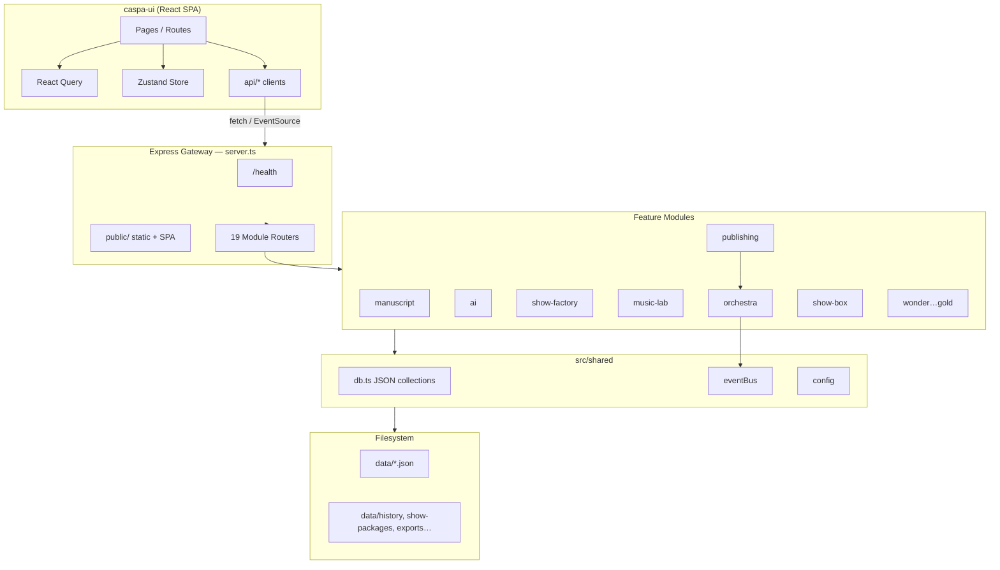
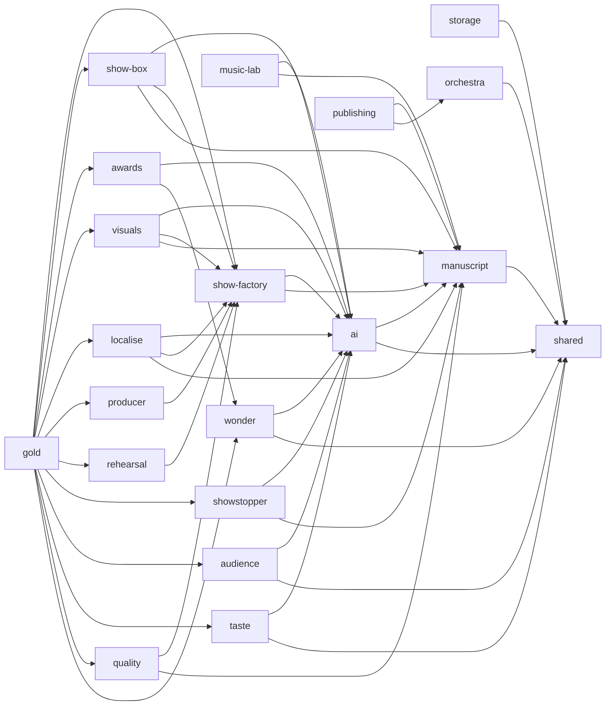
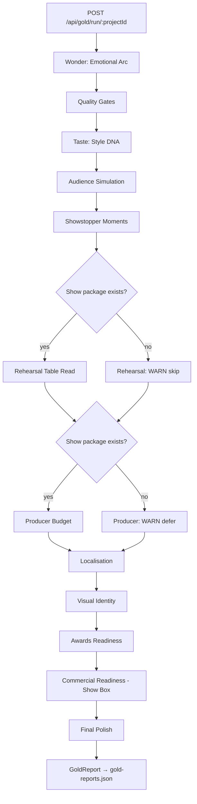
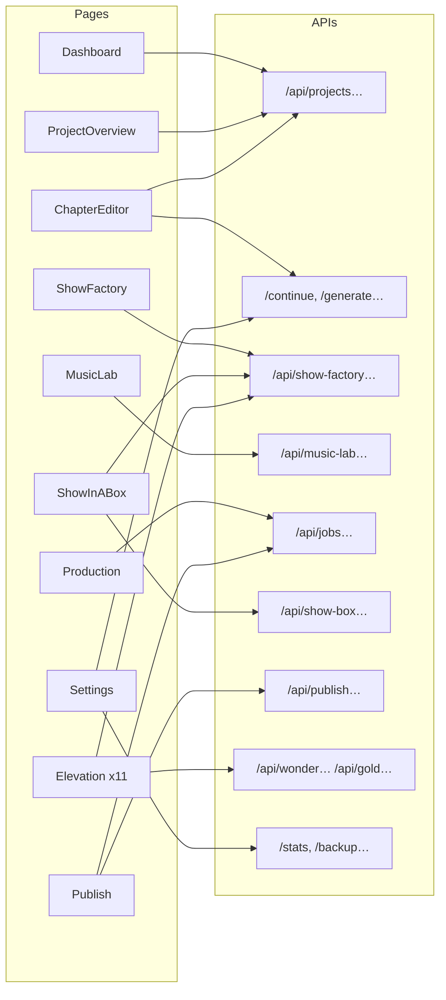

# CASPA Studio — Complete Architecture & Wiring Plan

**Repository:** `/Users/mattocrowley/Dropbox/caspa with knobs on`  
**Version:** 1.0.0  
**Last verified:** 2026-06-23 (Phase 6 completion)

---

## 1. SYSTEM OVERVIEW

### What CASPA Is

**CASPA Studio** (Creative Authoring & Show Production Application) is a monolithic Node/Express backend with a React/Vite SPA frontend. It supports the full creative lifecycle for novels and stage/radio shows:

- **Manuscript authoring** — projects, chapters, characters, plot, research
- **AI-assisted writing** — Ollama-first provider chain with cloud fallbacks
- **Show production** — Show Factory packages, Music Lab, cue lists
- **Publishing** — PDF, EPUB, KDP, IngramSpark (async jobs)
- **Commercial packaging** — Show In A Box (marketing, pitch decks, readiness)
- **Elevation (Phase 6)** — Wonder → Quality → Taste → Audience → Showstopper → Rehearsal → Producer → Localise → Visuals → Awards → **Gold** (12-step pipeline)

All persistent state lives in JSON files under `data/` (configurable via `DATA_DIR`). The UI is built separately (`caspa-ui/`) and deployed into `public/` so production serves **same-origin** API + SPA from one Express process on port **3000**.

### Layer Diagram

```
┌─────────────────────────────────────────────────────────────────┐
│  caspa-ui (React 18 + Vite + Tailwind)                          │
│  Routes · Sidebar · Zustand · React Query · api/* clients       │
└────────────────────────────┬────────────────────────────────────┘
                             │ fetch / EventSource
                             │ API_BASE = '' (prod) or VITE_API_URL (dev)
┌────────────────────────────▼────────────────────────────────────┐
│  Express Gateway — server.ts                                    │
│  helmet · cors · JSON 50mb · static public/ · SPA fallback      │
│  GET /health · error handler { success, error }                 │
└────────────────────────────┬────────────────────────────────────┘
                             │ app.use(router) × 19 modules
┌────────────────────────────▼────────────────────────────────────┐
│  Feature Modules — src/modules/*                                  │
│  manuscript · ai · show-factory · music-lab · orchestra ·         │
│  publishing · show-box · wonder…gold (Phase 6)                  │
└────────────────────────────┬────────────────────────────────────┘
                             │
┌────────────────────────────▼────────────────────────────────────┐
│  Shared Layer — src/shared/*                                      │
│  types · config · db · eventBus · logger · routeHelpers ·         │
│  elevationHelpers                                                 │
└────────────────────────────┬────────────────────────────────────┘
                             │
┌────────────────────────────▼────────────────────────────────────┐
│  Data Layer                                                       │
│  data/*.json collections · data/history/ · data/show-packages/ ·  │
│  data/exports/ · data/show-box/ · data/music-briefs/ ·            │
│  backups/*.zip · jobs.json                                        │
└─────────────────────────────────────────────────────────────────┘
```

### Request Flow (typical)

1. UI calls `apiCall('/api/projects')` → `fetch('' + path)` (same origin in prod).
2. Express matches module router → service layer → `readCollection` / `upsert`.
3. Response: `{ success: true, data: T }` or `{ success: false, error: string }`.
4. Long work: `jobQueue.enqueue()` → `JobWorker` polls → `eventBus` → SSE to UI.

### npm Scripts

| Script | Command | Purpose |
|--------|---------|---------|
| `dev` | `tsx watch server.ts` | Backend hot reload |
| `build` | `tsc` | Compile to `dist/` |
| `start` | `node dist/server.js` | Production server |
| `lint` | `tsc --noEmit` | Type check |
| `deploy:ui` | `cd caspa-ui && npm run build && rm -rf ../public/* && cp -r dist/* ../public/` | Build UI → `public/` |
| `deploy` | `deploy:ui && build` | Full deploy prep |

**UI scripts** (`caspa-ui/package.json`): `dev` (Vite), `build` (`tsc && vite build`), `preview`.

---

## 2. MODULE MAP (Phases 0–6)

Phases 0–5 are inferred from module structure; Phase 6 is documented in `docs/PHASE_6_AWARD_ENGINE_ARCHITECTURE.md`.

| Phase | Module | Path | Mount | Purpose | Key Dependencies |
|-------|--------|------|-------|---------|------------------|
| **0** | Shared | `src/shared/` | — | Types, config, JSON DB, event bus, logger, elevation helpers | Node fs, nanoid |
| **0** | Storage | `src/modules/storage/` | Root routes (`/stats`, `/backup`, …) | Backup, restore, export/import, Dropbox sync, stats | shared, archiver, multer |
| **1** | Manuscript | `src/modules/manuscript/` | `/api/projects`, `/api/chapters`, … | CRUD for projects, chapters, characters, plot, research | shared, eventBus |
| **2** | AI | `src/modules/ai/` | Root routes (`/generate`, `/continue`, …) | AIOrchestrator, Ollama + cloud providers, WritingAssistant | shared, manuscript (context) |
| **3** | Show Factory | `src/modules/show-factory/` | `/api/show-factory/*` | Generate theatre/radio/podcast/live-reading packages | manuscript, ai (ScriptAdapter) |
| **3** | Music Lab | `src/modules/music-lab/` | `/api/music-lab/*` | Tracks, briefs, chapter/character themes, overnight scheduler | manuscript, ai |
| **4** | Orchestra | `src/modules/orchestra/` | `/api/jobs/*` | JobQueue, JobWorker, SSEBroadcaster | shared eventBus |
| **5** | Publishing | `src/modules/publishing/` | `/api/publish/*` | PDF, EPUB, KDP, Ingram exports (async) | orchestra, manuscript, pdf-lib |
| **5** | Show Box | `src/modules/show-box/` | `/api/show-box/*` | Commercial readiness, marketing, cue lists, assets | manuscript, show-factory, ai |
| **6A** | Wonder | `src/modules/wonder/` | `/api/wonder/*` | Emotional arc, critic panel, polish, motifs | elevationHelpers, aiWithFallback |
| **6B** | Quality | `src/modules/quality/` | `/api/quality/*` | Multi-gate PASS/REVISE/BLOCK | manuscript, show-factory |
| **6C** | Taste | `src/modules/taste/` | `/api/taste/*` | Taste profiles, style DNA | aiWithFallback, db |
| **6D** | Audience | `src/modules/audience/` | `/api/audience/*` | Persona simulation, market fit | elevationHelpers, ai |
| **6E** | Showstopper | `src/modules/showstopper/` | `/api/showstopper/*` | Signature moments, killer lines, finales | manuscript, ai |
| **6F** | Rehearsal | `src/modules/rehearsal/` | `/api/rehearsal/*` | Table read, blocking, pacing | show-factory packages |
| **6G** | Producer | `src/modules/producer/` | `/api/producer/*` | Budget, venue, schedule, revenue | show-factory packages |
| **6H** | Localise | `src/modules/localise/` | `/api/localise/*` | Regional adaptation, jokes, cast/venue | manuscript, show-factory, ai |
| **6I** | Visuals | `src/modules/visuals/` | `/api/visuals/*` | Poster, palette, set/costume briefs | manuscript, show-factory, ai |
| **6J** | Awards | `src/modules/awards/` | `/api/awards/*` | Festival fit, submission packs | wonder (scorer), ai |
| **6K** | Gold | `src/modules/gold/` | `/api/gold/*` | 12-step elevation pipeline + report | All Phase 6 + show-box |
| **6L** | UI Integration | `caspa-ui/` | React routes | Sidebar ✨ ELEVATION, API clients, pages | config.ts + api/* only |

**Server mount order** (`server.ts`): storage → manuscript → ai → show-factory → music-lab → orchestra → publishing → show-box → wonder → quality → taste → audience → showstopper → rehearsal → producer → localise → visuals → awards → gold → static `public/` → SPA fallback.

On startup: `jobWorker.start()` (publishing handlers register on module import via `registerPublishingHandlers()` in `publishing/index.ts`).

---

## 3. DATA LAYER

### JSON Collections (`data/{name}.json`)

| Collection file | Used by | Contents |
|-----------------|---------|----------|
| `projects.json` | Manuscript | Project metadata |
| `chapters.json` | Manuscript, elevation, publishing | Chapter content, word counts |
| `characters.json` | Manuscript, show-box | Character profiles |
| `plot-points.json` | Manuscript PlotService | Plot board entries |
| `research-notes.json` | Manuscript ResearchService | Research notes |
| `show-packages.json` | Show Factory | Generated show packages |
| `show-factory-jobs.json` | Show Factory | Inline job status for package generation |
| `music-tracks.json` | Music Lab | Track metadata |
| `jobs.json` | Orchestra JobQueue | Global async jobs (exports, etc.) |
| `exports.json` | Publishing | ExportJob records |
| `commercial-readiness-reports.json` | Show Box | Cached commercial reports |
| `cue-lists.json` | Show Box LivePerformanceMode | Performance cue lists |
| `motifs.json` | Wonder MotifLedger | Motif CRUD |
| `taste-profiles.json` | Taste | TasteProfile CRUD |
| `taste-preferences.json` | Taste PreferenceMemory | Preference memory |
| `gold-reports.json` | Gold | GoldReport history |

**DB API** (`src/shared/db.ts`): `readCollection`, `writeCollection` (atomic tmp+rename), `findById`, `upsert`, `deleteById`, `generateId` (nanoid 12).

### File Storage Patterns (non-JSON)

| Path | Purpose |
|------|---------|
| `data/history/` | Chapter version snapshots (ChapterService) |
| `data/show-packages/{packageId}/` | Generated show component files (scripts, etc.) |
| `data/music-briefs/` | Music composition brief JSON/XML per track |
| `data/exports/{projectId}/` | PDF, EPUB, KDP, Ingram output files |
| `data/show-box/{projectId}/` | Pitch deck, press kit, marketing assets |
| `data/show-box/cue-lists/` | Cue list PDF exports |
| `backups/*.zip` | Full `data/` directory archives |
| `exports/export-*.json` | Full data export snapshots (StorageService) |

### Job Persistence

- **Orchestra** (`jobs.json`): types `pdf-export`, `epub-export`, `kdp-package`, `ingram-package`; max 3 concurrent; 24h cleanup of completed/failed; running jobs reset to queued on restart.
- **Show Factory** (`show-factory-jobs.json`): separate from orchestra; polled via `/api/show-factory/status/:id`.
- **Music Lab**: in-memory job map + eventBus emissions; status via `/api/music-lab/jobs/:id`.

---

## 4. EVENT BUS & JOBS

### EventBus (`src/shared/eventBus.ts`)

Typed `EventEmitter` wrapper. Events:

| Event | Payload | Emitters |
|-------|---------|----------|
| `project:created` | `Project` | ProjectService |
| `project:updated` | `Project` | ProjectService |
| `project:deleted` | `{ id }` | ProjectService |
| `chapter:created` | `Chapter` | ChapterService |
| `chapter:updated` | `Chapter` | ChapterService |
| `chapter:deleted` | `{ id, projectId }` | ChapterService |
| `job:queued` | `JobStatus` | JobQueue, ShowFactory, MusicLab |
| `job:progress` | `JobStatus` | JobQueue, ShowFactory, MusicLab, OvernightScheduler |
| `job:complete` | `JobStatus` | JobQueue, ShowFactory, MusicLab |
| `job:failed` | `JobStatus` | JobQueue, ShowFactory, MusicLab |
| `ai:request` | `AIRequest` | AIOrchestrator |
| `ai:response` | `AIResponse` | AIOrchestrator |
| `export:started` | `ExportJob` | publishing-routes |
| `export:complete` | `ExportJob` | publishing-routes |
| `backup:started` | `{ path }` | StorageService |
| `backup:complete` | `{ path }` | StorageService |

**Note:** No UI subscribers for project/chapter/ai events today — only job events drive SSE.

### JobQueue → JobWorker → SSE Flow

```
POST /api/publish/pdf
  → createExportJob + jobQueue.enqueue('pdf-export', payload)
  → emit job:queued
  → JobWorker.poll (2s interval, max 3 running)
  → claimNextJob → handler (registered in publishing/index.ts)
  → updateJob(progress) → emit job:progress
  → updateJob(complete) → emit job:complete

SSEBroadcaster (orchestra/SSEBroadcaster.ts)
  listens: job:queued|progress|complete|failed
  → writes event: job-update to connected clients

UI:
  GET /api/jobs/stream        → all jobs (Production page)
  GET /api/jobs/:id/stream    → single job (Publish, useJobTracker)
  Poll fallback: GET /api/jobs/:id every 2s
```

**Registered job handlers** (only in `publishing/index.ts`):

- `pdf-export`, `epub-export`, `kdp-package`, `ingram-package`

Show Factory and Music Lab emit job events but use their own status endpoints (not orchestra queue).

---

## 5. AI PIPELINE

### Provider Chain (`AIOrchestrator.ts`)

Order (first available wins):

1. **Ollama** (local) — `OLLAMA_URL`, `OLLAMA_MODEL` (default `llama3.2`)
2. **Gemini** — `GEMINI_API_KEY`
3. **Grok** — `GROK_API_KEY`
4. **OpenAI** — `OPENAI_API_KEY`
5. **Anthropic** — `ANTHROPIC_API_KEY`

**Streaming:** Ollama-only native stream; otherwise full generate then single chunk callback.

**Context building:** `generateWithContext(projectId)` loads project, characters, research, last 3 chapters (truncated ~4000 tokens).

### Elevation Fallback (`elevationHelpers.aiWithFallback`)

Phase 6 engines call `aiWithFallback(prompt, context, deterministicFallback, projectId?)`. On AI failure or empty response → returns `{ text, source: 'deterministic' }`.

### Modules Using AIOrchestrator / aiWithFallback

| Module | Direct `aiOrchestrator` | Via `aiWithFallback` |
|--------|-------------------------|----------------------|
| AI routes / WritingAssistant | ✓ | — |
| Wonder (EmotionalArc, CriticPanel, FinalPolish, etc.) | — | ✓ |
| Taste (StyleDNAExtractor, tasteEngine) | — | ✓ |
| Audience (ReactionSimulator, ReaderReviewSimulator) | — | ✓ |
| Showstopper (SignatureMomentFinder, KillerLineGenerator) | — | ✓ |
| Rehearsal (ActorTableRead) | — | ✓ |
| Localise (LocalJokeEngine) | — | ✓ |
| Visuals (VisualIdentityEngine) | — | ✓ |
| Awards (ArtisticStatementGenerator, SubmissionStatementWriter) | — | ✓ |
| Show Box (CommercialReadinessEngine) | ✓ | — |
| Show Factory (ScriptAdapter) | ✓ | — |
| Music Lab (MusicLabService) | ✓ | — |

Quality gates are **deterministic** (no AI orchestrator).

---

## 6. COMPLETE API WIRING TABLE

**Envelope convention:** `{ success: boolean, data?, error? }` unless noted.

### System

| Method | Path | Backend Service | UI Client | UI Page |
|--------|------|-----------------|-----------|---------|
| GET | `/health` | server.ts | `client.getHealth()` | Settings |
| — | *SPA* | `public/index.html` | React Router | All non-API routes |

### Storage (no `/api` prefix)

| Method | Path | Service | UI Client | UI Page |
|--------|------|---------|-----------|---------|
| GET | `/stats` | StorageService.getStats | `client.getStorageStats()` | Settings |
| GET | `/backups` | StorageService.listBackups | `client.listBackups()` | Settings |
| POST | `/backup` | StorageService.backup | `client.triggerBackup()` | Settings |
| POST | `/restore` | StorageService.restore | `client.restoreBackup()` | Settings |
| GET | `/export` | StorageService.exportDataAsJSON | `client.exportData()` | Settings |
| POST | `/import` | StorageService.importDataFromJSON | `client.importData()` | Settings |
| GET | `/dropbox/status` | DropboxSync | `client.getDropboxStatus()` | Settings |
| POST | `/dropbox/push` | DropboxSync | `client.pushDropbox()` | Settings |
| POST | `/dropbox/pull` | DropboxSync | `client.pullDropbox()` | Settings |

### Manuscript — `/api/projects`, `/api/chapters`, etc.

| Method | Path | Service | UI Client | UI Page |
|--------|------|---------|-----------|---------|
| GET | `/api/projects` | ProjectService.listProjects | `projects.listProjects` | Dashboard, Sidebar, many pages |
| POST | `/api/projects` | ProjectService.createProject | `projects.createProject` | Dashboard |
| GET | `/api/projects/:id` | ProjectService.getProject | `projects.getProject` | ProjectOverview |
| PUT | `/api/projects/:id` | ProjectService.updateProject | `projects.updateProject` | ProjectOverview |
| DELETE | `/api/projects/:id` | ProjectService.deleteProject | `projects.deleteProject` | Dashboard |
| GET | `/api/projects/:id/stats` | ProjectService.getProjectStats | `projects.getProjectStats` | ProjectOverview |
| GET | `/api/projects/:id/chapters` | ChapterService.listChapters | `chapters.listChapters` | ProjectOverview, ChapterEditor |
| POST | `/api/projects/:id/chapters` | ChapterService.createChapter | `chapters.createChapter` | ProjectOverview |
| POST | `/api/projects/:id/chapters/reorder` | ChapterService.reorderChapters | `chapters.reorderChapters` | ProjectOverview |
| GET | `/api/chapters/:id` | ChapterService.getChapter | `chapters.getChapter` | ChapterEditor |
| PUT | `/api/chapters/:id` | ChapterService.updateChapter | `chapters.updateChapter` | ChapterEditor |
| DELETE | `/api/chapters/:id` | ChapterService.deleteChapter | `chapters.deleteChapter` | ProjectOverview |
| GET | `/api/chapters/:id/history` | ChapterService.getChapterHistory | `chapters.getChapterHistory` | ChapterEditor |
| POST | `/api/chapters/:id/restore` | ChapterService.restoreChapter | `chapters.restoreChapter` | ChapterEditor |
| GET | `/api/projects/:id/characters` | CharacterService.listCharacters | `chapters.listCharacters` | Characters |
| POST | `/api/projects/:id/characters` | CharacterService.createCharacter | `chapters.createCharacter` | Characters |
| GET | `/api/characters/:id` | CharacterService.getCharacter | `chapters.getCharacter` | Characters |
| PUT | `/api/characters/:id` | CharacterService.updateCharacter | `chapters.updateCharacter` | Characters |
| DELETE | `/api/characters/:id` | CharacterService.deleteCharacter | `chapters.deleteCharacter` | Characters |
| GET | `/api/projects/:id/relationship-map` | CharacterService.getCharacterRelationshipMap | `chapters.getRelationshipMap` | Characters |
| GET | `/api/projects/:id/plot` | PlotService.listPlotPoints | `plot.listPlotPoints` | PlotBoard |
| POST | `/api/projects/:id/plot` | PlotService.createPlotPoint | `plot.createPlotPoint` | PlotBoard |
| PUT | `/api/plot/:id` | PlotService.updatePlotPoint | `plot.updatePlotPoint` | PlotBoard |
| DELETE | `/api/plot/:id` | PlotService.deletePlotPoint | `plot.deletePlotPoint` | PlotBoard |
| POST | `/api/projects/:id/plot/reorder` | PlotService.reorderPlotPoints | `plot.reorderPlotPoints` | PlotBoard |
| GET | `/api/projects/:id/research` | ResearchService.listNotes | `research.listNotes` | Research |
| GET | `/api/projects/:id/research/search` | ResearchService.searchNotes | `research.searchNotes` | Research |
| POST | `/api/projects/:id/research` | ResearchService.createNote | `research.createNote` | Research |
| PUT | `/api/research/:id` | ResearchService.updateNote | `research.updateNote` | Research |
| DELETE | `/api/research/:id` | ResearchService.deleteNote | `research.deleteNote` | Research |

### AI (no `/api` prefix)

| Method | Path | Service | UI Client | UI Page |
|--------|------|---------|-----------|---------|
| POST | `/generate` | AIOrchestrator.generate | `assistant.generate` | AIPanel |
| POST | `/generate/stream` | AIOrchestrator.streamGenerate (SSE) | `assistant.streamGenerate` | AIPanel, ChapterEditor |
| GET | `/providers` | AIOrchestrator.getAvailableProviders | `assistant.getProviders` | Settings |
| GET | `/models` | OllamaClient.listModels | `assistant.getModels` | Settings |
| POST | `/continue` | WritingAssistant.continueChapter | `assistant.continueChapter` | AIPanel |
| POST | `/rewrite` | WritingAssistant.rewriteSelection | `assistant.rewriteSelection` | AIPanel |
| POST | `/plot-suggest` | WritingAssistant.suggestPlotPoints | `assistant.suggestPlotPoints` | AIPanel, PlotBoard |
| POST | `/dialogue` | WritingAssistant.generateCharacterDialogue | `assistant.generateDialogue` | AIPanel, Characters |
| POST | `/critique` | WritingAssistant.critiqueChapter | `assistant.critiqueChapter` | AIPanel |
| POST | `/summary` | WritingAssistant.generateChapterSummary | `assistant.generateSummary` | AIPanel |
| POST | `/consistency` | WritingAssistant.checkConsistency | `assistant.checkConsistency` | AIPanel |
| POST | `/title` | WritingAssistant.generateTitle | `assistant.generateTitles` | AIPanel |
| POST | `/style-lock` | WritingAssistant.matchWritingStyle | `assistant.styleLock` | AIPanel |

### Show Factory — `/api/show-factory/*`

| Method | Path | Service | UI Client | UI Page |
|--------|------|---------|-----------|---------|
| GET | `/api/show-factory/packages/:projectId` | ShowFactoryService.listShowPackages | `showFactory.listShowPackages` | ShowFactory, Rehearsal, Producer, Visuals, ShowInABox |
| POST | `/api/show-factory/generate` | ShowFactoryService.generateShowPackage | `showFactory.generateShowPackage` | ShowFactory |
| GET | `/api/show-factory/package/:id` | ShowFactoryService.getShowPackage | `showFactory.getShowPackage` | ShowFactory |
| DELETE | `/api/show-factory/package/:id` | ShowFactoryService.deleteShowPackage | `showFactory.deleteShowPackage` | ShowFactory |
| GET | `/api/show-factory/export/:id` | ShowFactoryService.exportShowPackage | `showFactory.downloadShowPackage` | ShowFactory |
| GET | `/api/show-factory/status/:id` | ShowFactoryService.getJobStatus | `showFactory.getShowFactoryJobStatus` | ShowFactory |

### Music Lab — `/api/music-lab/*`

| Method | Path | Service | UI Client | UI Page |
|--------|------|---------|-----------|---------|
| GET | `/api/music-lab/tracks` | MusicLabService.listTracks | `musicLab.listTracks` | MusicLab |
| POST | `/api/music-lab/tracks` | MusicLabService.createTrack | `musicLab.createTrack` | MusicLab |
| GET | `/api/music-lab/tracks/:id` | MusicLabService.getTrackWithBrief | `musicLab.getTrack` | MusicLab |
| DELETE | `/api/music-lab/tracks/:id` | MusicLabService.deleteTrack | `musicLab.deleteTrack` | MusicLab |
| POST | `/api/music-lab/generate/chapter` | MusicLabService.generateChapterTheme | `musicLab.generateChapterTheme` | MusicLab |
| POST | `/api/music-lab/generate/character` | MusicLabService.generateCharacterLeitmotif | `musicLab.generateCharacterLeitmotif` | MusicLab |
| POST | `/api/music-lab/generate/pack` | MusicLabService.generateAtmosphericPack | `musicLab.generateAtmosphericPack` | MusicLab |
| POST | `/api/music-lab/overnight/schedule` | OvernightScheduler.scheduleOvernightRun | `musicLab.scheduleOvernight` | MusicLab |
| GET | `/api/music-lab/overnight` | OvernightScheduler.listSchedules | `musicLab.listOvernightSchedules` | MusicLab |
| DELETE | `/api/music-lab/overnight/:id` | OvernightScheduler.cancelSchedule | `musicLab.cancelOvernightSchedule` | MusicLab |
| GET | `/api/music-lab/jobs/:id` | MusicLabService.getJobStatus | `musicLab.getMusicLabJob` | MusicLab |

### Orchestra — `/api/jobs/*`

| Method | Path | Service | UI Client | UI Page |
|--------|------|---------|-----------|---------|
| GET | `/api/jobs/stats` | JobQueue.getQueueStats | `jobs.getQueueStats` | Production |
| GET | `/api/jobs/stream` | SSEBroadcaster | `jobs.subscribeToJobs` | Production |
| GET | `/api/jobs` | JobQueue.listJobs | `jobs.listJobs` | Production |
| GET | `/api/jobs/:id` | JobQueue.getJob | `jobs.getJob` | Publish, useJobTracker |
| GET | `/api/jobs/:id/stream` | SSEBroadcaster | `jobs.subscribeToJob` | useJobTracker |
| DELETE | `/api/jobs/:id` | JobQueue.cancelJob | `jobs.cancelJob` | Production |
| DELETE | `/api/jobs/clear/completed` | JobQueue.clearCompleted | `jobs.clearCompletedJobs` | Production |

### Publishing — `/api/publish/*`

| Method | Path | Service | UI Client | UI Page |
|--------|------|---------|-----------|---------|
| POST | `/api/publish/pdf` | jobQueue + PDFAssembler | `publishing.exportPdf` | Publish |
| POST | `/api/publish/epub` | jobQueue + EPUBBuilder | `publishing.exportEpub` | Publish |
| POST | `/api/publish/kdp` | jobQueue + KDPPackager | `publishing.exportKdp` | Publish |
| POST | `/api/publish/ingram` | jobQueue + KDPPackager | `publishing.exportIngram` | Publish |
| GET | `/api/publish/exports` | readCollection exports | `publishing.listExports` | Publish |
| GET | `/api/publish/exports/:id` | findById exports | `publishing.getExport` | Publish |
| GET | `/api/publish/download/:id` | res.download | `publishing.downloadExport` | Publish |
| POST | `/api/publish/validate/pdf` | PDFAssembler.validateCMYK | — | *(no UI)* |
| POST | `/api/publish/validate/kdp` | KDPPackager.validateForKDP | `publishing.validateKdp` | Publish |
| GET | `/api/publish/metadata/:projectId` | KDPPackager.generateMetadataXML | — | *(raw XML, no envelope)* |

### Show Box — `/api/show-box/*`

| Method | Path | Service | UI Client | UI Page |
|--------|------|---------|-----------|---------|
| POST | `/api/show-box/assess/:projectId` | CommercialReadinessEngine | `showBox.assessProject` | ShowInABox |
| GET | `/api/show-box/report/:projectId` | CommercialReadinessEngine | `showBox.getLatestReport` | ShowInABox |
| POST | `/api/show-box/pitch-deck/:projectId` | CommercialReadinessEngine | `showBox.generatePitchDeck` | ShowInABox |
| POST | `/api/show-box/press-kit/:projectId` | CommercialReadinessEngine | `showBox.generatePressKit` | ShowInABox |
| POST | `/api/show-box/marketing/:projectId` | CommercialReadinessEngine | `showBox.generateMarketingCopy` | ShowInABox |
| POST | `/api/show-box/social/:projectId` | CommercialReadinessEngine | `showBox.generateSocialPack` | ShowInABox |
| GET | `/api/show-box/download/:type/:projectId` | CommercialReadinessEngine | `showBox.downloadAsset` | ShowInABox |
| POST | `/api/show-box/cue-list` | LivePerformanceMode | `showBox.createCueList` | ShowInABox |
| GET | `/api/show-box/cue-list/:id` | LivePerformanceMode | `showBox.getCueList` | ShowInABox |
| PUT | `/api/show-box/cue-list/:id/cue/:cueId` | LivePerformanceMode | `showBox.updateCue` | ShowInABox |
| GET | `/api/show-box/cue-list/:id/pdf` | LivePerformanceMode | `showBox.downloadCueListPdf` | ShowInABox |

### Wonder — `/api/wonder/*`

| Method | Path | Service | UI Client | UI Page |
|--------|------|---------|-----------|---------|
| POST | `/api/wonder/analyse-project/:projectId` | EmotionalArcEngine | `wonder.analyseProject` | Wonder |
| POST | `/api/wonder/analyse-chapter/:chapterId` | EmotionalArcEngine | `wonder.analyseChapter` | *(client exists, page partial)* |
| POST | `/api/wonder/polish-text` | FinalPolishEngine | `wonder.polishText` | Wonder |
| POST | `/api/wonder/critic-panel` | CriticPanel | `wonder.criticPanel` | Wonder |
| POST | `/api/wonder/revision-ladder` | RevisionLadder | `wonder.revisionLadder` | Wonder |
| POST | `/api/wonder/audience-sim` | AudienceSimulator | `wonder.audienceSim` | Wonder |
| GET | `/api/wonder/motif-ledger` | MotifLedger | `wonder.listMotifs` | Wonder |
| POST | `/api/wonder/motif-ledger` | MotifLedger | `wonder.createMotif` | Wonder |
| PUT | `/api/wonder/motif-ledger/:id` | MotifLedger | — | *(no UI client)* |
| DELETE | `/api/wonder/motif-ledger/:id` | MotifLedger | `wonder.deleteMotif` | Wonder |
| GET | `/api/wonder/score/:projectId` | AwardReadinessScorer | `wonder.getWonderScore` | Wonder |

### Quality — `/api/quality/*`

| Method | Path | Service | UI Client | UI Page |
|--------|------|---------|-----------|---------|
| POST | `/api/quality/check-text` | qualityOrchestrator | `quality.checkText` | Quality |
| POST | `/api/quality/check-project/:projectId` | qualityOrchestrator | `quality.checkProject` | Quality |
| POST | `/api/quality/check-show/:showPackageId` | qualityOrchestrator | `quality.checkShow` | Quality |
| POST | `/api/quality/check-marketing` | qualityOrchestrator | `quality.checkMarketing` | Quality |
| POST | `/api/quality/final-gate/:projectId` | qualityOrchestrator | `quality.finalGate` | Quality |

### Taste — `/api/taste/*`

| Method | Path | Service | UI Client | UI Page |
|--------|------|---------|-----------|---------|
| GET | `/api/taste/profiles` | TasteProfileService | `taste.listProfiles` | Taste |
| GET | `/api/taste/profiles/:id` | TasteProfileService | — | *(no UI client)* |
| POST | `/api/taste/profiles` | TasteProfileService | — | *(no UI client)* |
| PUT | `/api/taste/profiles/:id` | TasteProfileService | — | *(no UI client)* |
| DELETE | `/api/taste/profiles/:id` | TasteProfileService | — | *(no UI client)* |
| POST | `/api/taste/extract-style` | StyleDNAExtractor | `taste.extractStyle` | Taste |
| POST | `/api/taste/apply-profile` | tasteEngine | `taste.applyProfile` | Taste |
| POST | `/api/taste/compare-output` | tasteEngine | `taste.compareOutput` | Taste |
| GET | `/api/taste/references` | ReferenceLibrary | — | *(no UI client)* |

### Audience — `/api/audience/*`

| Method | Path | Service | UI Client | UI Page |
|--------|------|---------|-----------|---------|
| POST | `/api/audience/simulate/:projectId` | ReactionSimulator | `audience.simulateProject` | Audience |
| POST | `/api/audience/test-text` | ReactionSimulator | `audience.testText` | Audience |
| GET | `/api/audience/market-fit/:projectId` | MarketFitScorer | `audience.getMarketFit` | Audience |
| POST | `/api/audience/review-sim/:projectId` | ReaderReviewSimulator | `audience.reviewSim` | Audience |
| GET | `/api/audience/ticket-buyer-fit/:projectId` | TicketBuyerPredictor | `audience.getTicketBuyerFit` | Audience |
| GET | `/api/audience/personas` | AudiencePersonaService | — | *(no UI client)* |

### Showstopper — `/api/showstopper/*`

| Method | Path | Service | UI Client | UI Page |
|--------|------|---------|-----------|---------|
| POST | `/api/showstopper/find/:projectId` | SignatureMomentFinder | `showstopper.findMoments` | Showstopper |
| POST | `/api/showstopper/killer-lines` | KillerLineGenerator | `showstopper.killerLines` | Showstopper |
| POST | `/api/showstopper/big-number/:projectId` | BigNumberGenerator | `showstopper.bigNumber` | Showstopper |
| POST | `/api/showstopper/finale/:projectId` | FinaleBuilder | `showstopper.finale` | Showstopper |
| POST | `/api/showstopper/trailer-moments/:projectId` | TrailerMomentExtractor | `showstopper.trailerMoments` | Showstopper |
| POST | `/api/showstopper/poster-quotes/:projectId` | buildShowstopperBundle | `showstopper.posterQuotes` | Showstopper |

### Rehearsal — `/api/rehearsal/*`

| Method | Path | Service | UI Client | UI Page |
|--------|------|---------|-----------|---------|
| POST | `/api/rehearsal/table-read/:showPackageId` | ActorTableRead | `rehearsal.tableRead` | Rehearsal |
| POST | `/api/rehearsal/dialogue-check` | DialogueSpeakability | `rehearsal.dialogueCheck` | Rehearsal |
| POST | `/api/rehearsal/blocking/:showPackageId` | BlockingAdvisor | `rehearsal.blocking` | Rehearsal |
| POST | `/api/rehearsal/pacing/:showPackageId` | PacingAnalyser | `rehearsal.pacing` | Rehearsal |
| POST | `/api/rehearsal/castability/:showPackageId` | CastabilityScorer | `rehearsal.castability` | Rehearsal |
| POST | `/api/rehearsal/notes/:showPackageId` | RehearsalNotesGenerator | `rehearsal.rehearsalNotes` | Rehearsal |

### Producer — `/api/producer/*`

| Method | Path | Service | UI Client | UI Page |
|--------|------|---------|-----------|---------|
| POST | `/api/producer/budget/:showPackageId` | BudgetEstimator | `producer.budget` | Producer |
| POST | `/api/producer/venue-fit/:showPackageId` | VenueFitScorer | `producer.venueFit` | Producer |
| POST | `/api/producer/rights-risk/:projectId` | RightsRiskScanner | `producer.rightsRisk` | Producer |
| POST | `/api/producer/schedule/:showPackageId` | ProductionScheduleBuilder | `producer.schedule` | Producer |
| POST | `/api/producer/cast-crew/:showPackageId` | CastCrewPlanner | `producer.castCrew` | Producer |
| POST | `/api/producer/revenue/:showPackageId` | RevenueScenarioModel | `producer.revenue` | Producer |

### Localise — `/api/localise/*`

| Method | Path | Service | UI Client | UI Page |
|--------|------|---------|-----------|---------|
| POST | `/api/localise/project/:projectId` | CommunityReferenceAdapter | `localise.adaptProject` | Localise |
| POST | `/api/localise/show/:showPackageId` | RegionalToneAdapter | `localise.adaptShow` | Localise |
| POST | `/api/localise/local-jokes` | LocalJokeEngine | `localise.localJokes` | Localise |
| POST | `/api/localise/cast-size` | CastCustomiser | `localise.castSize` | Localise |
| POST | `/api/localise/venue` | VenueCustomiser | `localise.venue` | Localise |
| POST | `/api/localise/sponsor-safe` | SponsorInsertEngine | `localise.sponsorSafe` | Localise |

### Visuals — `/api/visuals/*`

| Method | Path | Service | UI Client | UI Page |
|--------|------|---------|-----------|---------|
| POST | `/api/visuals/identity/:projectId` | VisualIdentityEngine | `visuals.identity` | Visuals |
| POST | `/api/visuals/poster/:projectId` | PosterCopyGenerator | `visuals.poster` | Visuals |
| POST | `/api/visuals/palette/:projectId` | ColourPaletteAdvisor | `visuals.palette` | Visuals |
| POST | `/api/visuals/set-brief/:showPackageId` | SetDesignBrief | `visuals.setBrief` | Visuals |
| POST | `/api/visuals/costume-brief/:showPackageId` | CostumeMoodboard | `visuals.costumeBrief` | Visuals |
| POST | `/api/visuals/trailer-script/:projectId` | TrailerScriptGenerator | `visuals.trailerScript` | Visuals |

### Awards — `/api/awards/*`

| Method | Path | Service | UI Client | UI Page |
|--------|------|---------|-----------|---------|
| POST | `/api/awards/readiness/:projectId` | AwardsReadinessPack | `awards.readiness` | Awards |
| POST | `/api/awards/festival-pack/:projectId` | FestivalFitFinder | `awards.festivalPack` | Awards |
| POST | `/api/awards/artist-statement/:projectId` | ArtisticStatementGenerator | `awards.artistStatement` | Awards |
| POST | `/api/awards/judges-brief/:projectId` | JudgesBriefGenerator | `awards.judgesBrief` | Awards |
| POST | `/api/awards/pull-quotes/:projectId` | PullQuoteSelector | `awards.pullQuotes` | Awards |
| POST | `/api/awards/category-fit/:projectId` | AwardReadinessScorer | `awards.categoryFit` | Awards |

### Gold — `/api/gold/*`

| Method | Path | Service | UI Client | UI Page |
|--------|------|---------|-----------|---------|
| POST | `/api/gold/run/:projectId` | GoldPipeline.run | `gold.runGoldPipeline` | Gold |
| GET | `/api/gold/report/:projectId` | GoldPipeline.getLatestReport | `gold.getGoldReport` | Gold |

---

## 7. UI ARCHITECTURE

### Tech Stack

- **React 18** + **React Router 6** + **Vite 6**
- **TanStack React Query 5** — server state (projects, jobs, packages)
- **Zustand 5** (persisted) — UI chrome + job cache + active project
- **Tailwind CSS** — design tokens (`accent`, `surface`, `muted`, etc.)
- **lucide-react** — icons

### API Configuration

```typescript
// caspa-ui/src/config.ts
export const API_BASE = import.meta.env.VITE_API_URL ?? '';
```

- **Production / integrated:** `API_BASE = ''` → same-origin (Express serves UI + API on `:3000`).
- **Vite dev:** No proxy in `vite.config.ts`. Either:
  - Run integrated: `npm run deploy:ui && npm run dev`, or
  - Set `VITE_API_URL=http://localhost:3000` in `caspa-ui/.env.local`.

### React Routes (`App.tsx`)

| Path | Page | Layout |
|------|------|--------|
| `/` | Dashboard | Layout |
| `/projects/:id` | ProjectOverview | Layout |
| `/projects/:id/characters` | Characters | Layout |
| `/projects/:id/plot` | PlotBoard | Layout |
| `/projects/:id/research` | Research | Layout |
| `/projects/:id/chapters/:chapterId` | ChapterEditor | **Standalone** (full width) |
| `/show-factory` | ShowFactory | Layout |
| `/music-lab` | MusicLab | Layout |
| `/production` | Production | Layout |
| `/show-in-a-box` | ShowInABox | Layout |
| `/publish` | Publish | Layout |
| `/wonder` … `/gold` | Elevation pages (11) | Layout |
| `/settings` | Settings | Layout |
| `*` | Redirect → `/` | — |

### Sidebar Structure (`Sidebar.tsx`)

1. **Primary nav:** Projects, Show Factory, Music Lab, Production, Show In A Box, Publish, Settings
2. **✨ ELEVATION:** Wonder, Quality, Taste, Audience, Showstopper, Rehearsal, Producer, Localise, Visuals, Awards, Gold
3. **Manuscript** (when `activeProjectId` set): Overview, Characters, Plot Board, Research
4. **Active Project** dropdown — syncs Zustand `activeProjectId`, navigates to project
5. **Command palette** (⌘K) — opens `CommandPalette`

### State Management

**Zustand** (`caspa-ui/src/store/index.ts`, persisted as `caspa-ui`):

- `activeProjectId`, `sidebarCollapsed`, `aiPanelOpen`
- `jobs[]` + `upsertJob` — mirrored from SSE/polling
- `toasts[]` — ephemeral notifications

**React Query** (global `staleTime: 30s`):

- `['projects']`, `['jobs']`, `['show-packages', projectId]`, `['gold-report', projectId]`, etc.
- Mutations invalidate related queries on success

### Streaming Patterns

| Pattern | Mechanism | Used by |
|---------|-----------|---------|
| AI text stream | POST `/generate/stream` → SSE `data: {chunk,done}` | AIPanel via `apiPostStream` |
| Job updates (all) | GET `/api/jobs/stream` → `event: job-update` | Production page |
| Job updates (one) | GET `/api/jobs/:id/stream` | `useJobTracker` (Publish) |
| Poll fallback | GET `/api/jobs/:id` every 2s | `useJobTracker` |
| Show Factory jobs | Poll `/api/show-factory/status/:id` (SSE off) | ShowFactory |

### Shared UI Components

- **Layout** — Sidebar + TopBar + Outlet + AIPanel + CommandPalette
- **ElevationWorkbench** — standard project picker + action area for all 11 elevation pages
- **AIPanel** — slide-out writing assistant (root AI routes)
- **JobProgressCard** — job status display
- **ToastProvider** — global toasts

### API Client Layer (`caspa-ui/src/api/`)

| File | Domain |
|------|--------|
| `client.ts` | `apiCall`, `apiStream`, `apiPostStream`, `apiDownload`, storage helpers |
| `projects.ts` | Manuscript projects |
| `chapters.ts` | Chapters + characters |
| `plot.ts`, `research.ts` | Plot + research |
| `assistant.ts` | Root AI routes |
| `showFactory.ts`, `musicLab.ts` | Phase 3 |
| `jobs.ts`, `publishing.ts` | Phase 4–5 async |
| `showBox.ts` | Show In A Box |
| `wonder.ts` … `gold.ts` | Phase 6 elevation |

**Rule:** UI must not import from `src/` backend — only `config.ts` + `api/*`.

---

## 8. PHASE 6 GOLD PIPELINE

### Gold 12-Step Sequence (`GoldPipeline.ts`)

Gold orchestrates existing module services synchronously in one HTTP request:

| Step | Key | Label | Service Called | Scoring |
|------|-----|-------|----------------|---------|
| 1 | `wonder-analysis` | Wonder — Emotional Arc | `emotionalArcEngine.analyseProject` | `arc.emotionalRange` |
| 2 | `quality-gate` | Quality Gates | `qualityOrchestrator.checkProject` | `quality.overallScore` |
| 3 | `taste-alignment` | Taste — Style DNA | `styleDNAExtractor.extract` | avg(authenticity, lyricism) |
| 4 | `audience-simulation` | Audience Simulation | `reactionSimulator.simulateProject` | persona heuristics |
| 5 | `showstopper-moments` | Showstopper Moments | `signatureMomentFinder.find` | fixed ~78 |
| 6 | `rehearsal-readiness` | Rehearsal Readiness | `actorTableRead.run` (first package) | skipped if no package |
| 7 | `producer-feasibility` | Producer Feasibility | `budgetEstimator.estimate` (first package) | budget heuristic |
| 8 | `localisation-check` | Localisation | `communityReferenceAdapter.adaptProject` | fixed ~70 |
| 9 | `visual-identity` | Visual Identity | `visualIdentityEngine.build` | fixed ~75 |
| 10 | `awards-readiness` | Awards Readiness | `awardsReadinessPack.build` | `awards.score` |
| 11 | `commercial-readiness` | Commercial Readiness | `commercialReadinessEngine.assessProject` | show-box score |
| 12 | `final-polish` | Final Polish | `finalPolishEngine.polish` (first 2000 chars) | AI vs deterministic |

**Output:** `GoldReport` persisted to `gold-reports.json` with `overallStatus`, `overallScore`, `steps[]`, `recommendations`, `blockers`.

**Show-package dependency:** Steps 6–7 use `showFactoryService.listShowPackages(projectId)[0]`; without a package, steps run with `PASS_WITH_WARNINGS` and deferred summaries.

### Individual Module Connections

```
Manuscript (projects, chapters)
    ↓
Wonder ──→ Quality ──→ Taste ──→ Audience ──→ Showstopper
    ↓                                              ↓
Show Factory (show-packages) ←──────────────── Rehearsal, Producer, Visuals (set/costume)
    ↓
Localise ← manuscript + show
    ↓
Visuals, Awards
    ↓
Show Box (commercial) ← Gold step 11
    ↓
Gold (aggregates all) → gold-reports.json
```

---

## 9. DEPLOYMENT WIRING

### Environment (`.env.example`)

```
PORT=3000
DATA_DIR=./data
OLLAMA_URL=http://localhost:11434
OLLAMA_MODEL=llama3.2
GEMINI_API_KEY=
OPENAI_API_KEY=
ANTHROPIC_API_KEY=
GROK_API_KEY=
DROPBOX_TOKEN=
BACKUP_DIR=./backups
LOG_LEVEL=info
```

### Build & Serve Flow

```bash
npm install && cd caspa-ui && npm install && cd ..
npm run deploy:ui    # Vite build → public/
npm run build        # tsc → dist/
npm start            # node dist/server.js → :3000
```

### Same-Origin API

- UI built with `API_BASE = ''`.
- Express serves `public/` at `/` with cache headers:
  - `index.html` → no-cache
  - `/assets/*` → immutable 1 year
- SPA fallback sends `index.html` for non-API, non-asset paths.
- **Critical:** `/api/*` and `/assets/*` never fall through to SPA (prevents blank-page JS hash mismatch).

### Dev Workflow Options

| Mode | Backend | Frontend | API_BASE |
|------|---------|----------|----------|
| Integrated | `npm run dev` | `deploy:ui` once | `''` |
| Split dev | `npm run dev` | `cd caspa-ui && npm run dev` | `VITE_API_URL=http://localhost:3000` |

### Static Assets

- Source: `caspa-ui/dist/` after Vite build
- Deploy target: `public/` (gitignored content, replaced by `deploy:ui`)
- Hashed bundles under `public/assets/`

---

## 10. MERMAID DIAGRAMS

### Full Stack Diagram



### Module Dependency Graph



### Gold Pipeline Flow



### UI Route → API Map (High Level)



---

## 11. UI REDESIGN INTEGRATION RULES

### Golden Rules

1. **Single API base:** Only `caspa-ui/src/config.ts` defines `API_BASE`. Never hardcode `localhost:3000` in components.
2. **No backend imports:** UI must not import from `src/modules` or `src/shared`. All access via `caspa-ui/src/api/*`.
3. **Response envelope:** Expect `{ success, data?, error? }`. Use `apiCall()` which throws `ApiError` on `success: false`.
4. **Active project:** Use Zustand `activeProjectId` for cross-page context; elevation pages also allow local override via `ElevationWorkbench`.
5. **Show-package modules:** Rehearsal, Producer, Visuals (set/costume), Localise (show) require a Show Factory package — UI must list packages via `listShowPackages(projectId)`.
6. **Long operations:** Publishing uses orchestra jobs + `useJobTracker`. Show Factory uses its own status endpoint. Gold runs synchronously (can be slow for large projects).
7. **Streaming:** AI uses `apiPostStream`; jobs use `EventSource` via `apiStream`. Do not mix patterns.
8. **Route parity:** Every new backend route needs: `*-routes.ts` → `server.ts` mount → `caspa-ui/src/api/*.ts` → page component.
9. **SPA safety:** New API paths must start with `/api/` (or be listed in server.ts before SPA fallback). Asset paths under `/assets/`.
10. **Types:** Shared domain types mirrored in `caspa-ui/src/types.ts` for elevation and core entities.

### Swap Procedure (replace UI without touching backend)

1. Keep `caspa-ui/src/api/*` and `config.ts` interfaces stable (or version them).
2. Replace pages/components under `caspa-ui/src/pages/` and `components/`.
3. Preserve route paths in `App.tsx` (or add redirects from old paths).
4. Run `npm run deploy:ui` to refresh `public/`.
5. Smoke test: `GET /health`, one manuscript CRUD, one elevation POST, one job flow.

### Response Envelope Examples

**Success:**

```json
{ "success": true, "data": { "id": "abc", "title": "My Novel" } }
```

**Error:**

```json
{ "success": false, "error": "Project not found: xyz" }
```

**Exceptions (no envelope):**

- `GET /health` → `{ status, version, timestamp }`
- `GET /api/publish/metadata/:projectId` → raw XML
- File downloads → binary stream with `Content-Disposition`

---

## 12. GAPS / LIMITATIONS

### AI & Deterministic Fallback

- When Ollama and all cloud keys are unavailable, elevation engines return **deterministic heuristics** via `aiWithFallback` — results are usable but not LLM-quality.
- Quality gates are fully rule-based (no AI).

### Architecture Inconsistencies

- **Route prefix split:** Most APIs use `/api/*`; AI and Storage use **root paths** (`/generate`, `/stats`). UI clients reflect this (`assistant.ts` vs `projects.ts`).
- **Collection name mismatch in StorageService export:** Hardcoded `plotPoints` / `researchNotes` vs actual `plot-points` / `research-notes` — export may miss canonical names (import still works for all `.json` files in `data/`).
- **Multiple job systems:** Orchestra queue, Show Factory inline jobs, Music Lab in-memory jobs — not unified.

### UI Coverage Gaps (backend exists, UI incomplete)

- Taste profile CRUD (`POST/PUT/DELETE /api/taste/profiles`)
- `GET /api/taste/references`
- `GET /api/audience/personas`
- `PUT /api/wonder/motif-ledger/:id`
- `POST /api/publish/validate/pdf`
- `wonder.analyseChapter` — client exists, limited page wiring

### Operational

- **No git remote** documented; rollback via `.caspa_snapshots/pre_phase6_20260623_051221.tar.gz`.
- **Vite dev has no proxy** — split dev requires `VITE_API_URL`.
- **Gold pipeline is synchronous** — long-running for large manuscripts; no progress SSE.
- **CORS `origin: '*'`** — fine for local; tighten for production deployment.
- **No authentication** — single-user local studio model.
- **Hetzner deployment** intentionally skipped per Phase 6 report.

### Show-Package Dependency

Rehearsal, Producer, Visuals (set/costume), and Gold steps 6–7 degrade gracefully without Show Factory output but cannot produce full analysis.

---

## Quick Reference: File Locations

| Concern | Path |
|---------|------|
| Server entry | `server.ts` |
| Shared layer | `src/shared/` |
| Module routers | `src/modules/*/*-routes.ts` |
| UI entry | `caspa-ui/src/main.tsx` |
| UI routes | `caspa-ui/src/App.tsx` |
| Sidebar | `caspa-ui/src/components/Sidebar.tsx` |
| API clients | `caspa-ui/src/api/` |
| API base URL | `caspa-ui/src/config.ts` |
| Deployed UI | `public/` |
| Phase 6 docs | `docs/PHASE_6_AWARD_ENGINE_ARCHITECTURE.md`, `docs/PHASE_6_COMPLETION_REPORT.md` |

---

This document is intended as the single reference for **UI redesign** or **backend extension**. Preserve the API envelope, mount paths, and `api/*` client layer; everything else in the UI is swappable.
